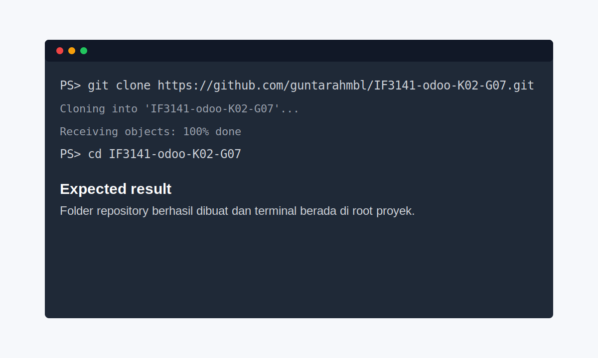
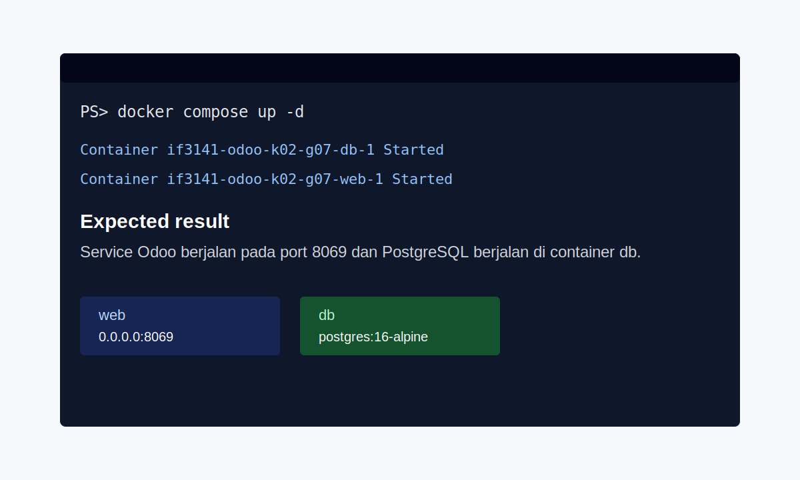
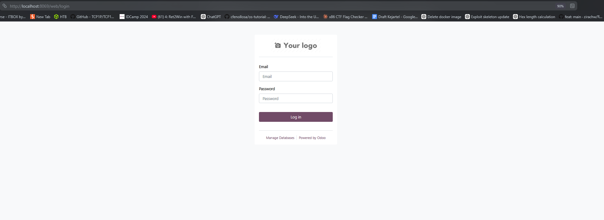
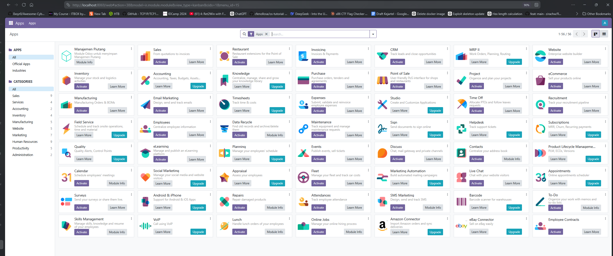
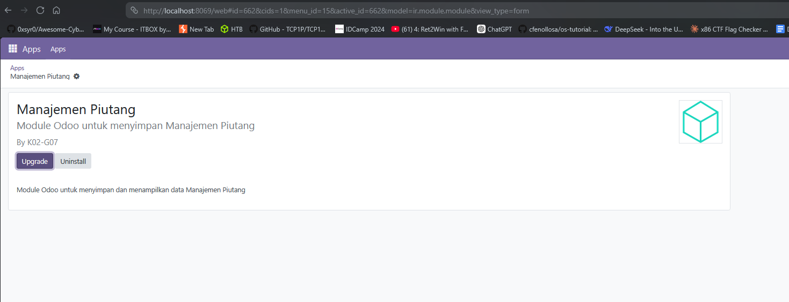
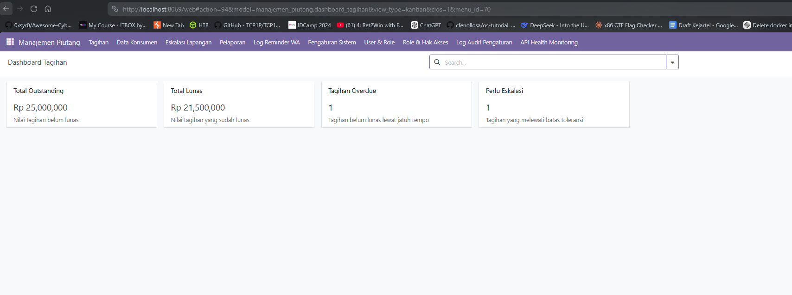
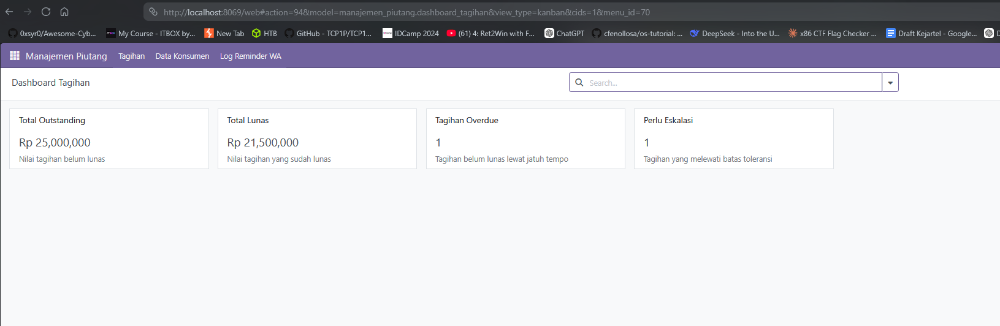

# Sistem Manajemen Piutang dan E-Invoicing

## Identitas Kelompok

| Informasi | Keterangan |
| --- | --- |
| Nama Kelompok | Kelompok 01 |
| Nomor Kelompok | G01 |
| Nomor Kelas | K02 |
| Nama Sistem | Sistem Manajemen Piutang dan E-Invoicing |
| Perusahaan | CV Metro Karya Mandiri |
| Platform | Odoo 17, PostgreSQL 16, Docker Compose |

## Anggota Kelompok

| NIM | Nama |
| --- | --- |
| 13523076 | Nadhif Al Rozin |
| 13523077 | Albertus Christian Poandy |
| 13523086 | Bob Kunanda |
| 13523098 | Muhammad Adha Ridwan |
| 13523114 | Guntara Hambali |

## Deskripsi Sistem

Sistem Manajemen Piutang dan E-Invoicing adalah sistem informasi berbasis Odoo yang dikembangkan untuk membantu CV Metro Karya Mandiri mengelola proses penagihan pelanggan secara lebih terstruktur. Sistem ini menyediakan fitur pengelolaan data konsumen, pencatatan tagihan, pemantauan status pelunasan, pembuatan invoice digital melalui payment gateway, pengiriman pengingat WhatsApp, serta pencatatan riwayat pembayaran dan log reminder.

Sistem ini juga mendukung pemisahan hak akses berdasarkan role pengguna, seperti Spesialis Pendapatan, Manajer Keuangan, Staff Penagihan Piutang, Direktur Utama, dan Administrator Sistem. Dengan pembagian peran tersebut, setiap pengguna hanya melihat dan mengelola data yang relevan dengan tanggung jawabnya. Dashboard dan laporan piutang membantu manajemen memantau kondisi piutang, tren penerimaan kas, status keterlambatan, dan kebutuhan eskalasi penagihan lapangan.

## Fitur Utama

- Pengelolaan data konsumen B2B dan B2C.
- Pengelolaan tagihan, status pelunasan, aging piutang, dan eskalasi.
- Pembuatan e-invoice dengan integrasi Xendit.
- Pengiriman reminder WhatsApp melalui Fonnte.
- Webhook pembayaran untuk rekonsiliasi otomatis.
- Dashboard KPI piutang dan tren penerimaan kas.
- Laporan piutang dan monitoring kesehatan API.
- Role-based access control untuk setiap pengguna sistem.

## Struktur Repository

| Path | Keterangan |
| --- | --- |
| `config/` | Konfigurasi Odoo. |
| `custom_addons/manajemen_piutang/` | Modul utama Sistem Manajemen Piutang dan E-Invoicing. |
| `dump/` | Backup database dan filestore untuk proses import/export. |
| `scripts/` | Script migrasi database untuk Windows dan Linux/macOS. |
| `docker-compose.yml` | Konfigurasi service Odoo, PostgreSQL, dan helper Alpine. |
| `PAYMENT_CONTRACT.md` | Kontrak integrasi payment gateway dan webhook. |

## Prasyarat

Pastikan perangkat sudah memiliki:

- Docker Desktop.
- Git.
- Python 3.11, jika ingin melakukan development modul dengan virtual environment lokal.

## Cara Menjalankan Sistem

### 1. Clone repository dan masuk ke folder proyek

```bash
git clone https://github.com/guntarahmbl/IF3141-odoo-K02-G07.git
cd IF3141-odoo-K02-G07
```

Expected result:



### 2. Jalankan service Odoo dan PostgreSQL

```bash
docker compose up -d
```

Expected result:



### 3. Buka Odoo di browser

Akses aplikasi melalui:

```text
http://localhost:8069
```

Expected result:



### 4. Login sebagai administrator awal

Gunakan kredensial default berikut untuk konfigurasi awal:

```text
Username: admin
Password: admin
```

Expected result:



### 5. Aktifkan atau perbarui modul Manajemen Piutang

Masuk ke menu **Apps**, aktifkan developer mode bila diperlukan, klik **Update Apps List**, lalu cari dan install atau upgrade modul **Manajemen Piutang**.

Jika ingin memperbarui modul melalui terminal, jalankan:

```bash
docker compose exec web odoo -c /etc/odoo/odoo.conf -d postgres -u manajemen_piutang --stop-after-init
docker compose up -d
```

Expected result:



### 6. Buka menu Manajemen Piutang

Setelah modul aktif, buka menu **Manajemen Piutang**. Data dummy akan tersedia untuk mencoba fitur tagihan, konsumen, dashboard, laporan, pengaturan, serta role pengguna.

Expected result:



### 7. Coba login dengan role yang berbeda

Logout dari administrator, lalu login menggunakan salah satu kredensial role pada bagian berikutnya. Setiap role akan menampilkan menu sesuai hak aksesnya.

Expected result:



## Kredensial Role

Kredensial berikut dibuat oleh data dummy modul `manajemen_piutang`.

| Role | Nama Demo | Email/Login | Password | Hak Akses Utama |
| --- | --- | --- | --- | --- |
| Spesialis Pendapatan | Budi (Spesialis) | `spesialis@demo.com` | `user123` | Mengelola konsumen, tagihan, dashboard, dan log reminder. |
| Manajer Keuangan | Siti (Manajer) | `manajer@demo.com` | `user123` | Mengelola konsumen, tagihan, kunjungan, laporan, pengaturan, dashboard, dan monitoring. |
| Staff Penagihan Piutang | Joko (Staff Lapangan) | `staff@demo.com` | `user123` | Melihat tagihan dan mengelola eskalasi atau kunjungan lapangan. |
| Direktur Utama | Pak Direktur | `direktur@demo.com` | `user123` | Melihat dashboard, laporan, konsumen, tagihan, dan pembayaran. |
| Administrator Sistem | Administrator | `admin@demo.com` | `user123` | Mengelola seluruh fitur, role pengguna, pengaturan sistem, log audit, dan monitoring API. |
| Administrator Awal Odoo | Administrator Odoo | `admin` | `admin` | Digunakan untuk setup awal Odoo dan instalasi modul. |

## Migrasi Database

Matikan service sebelum melakukan import atau export database:

```bash
docker compose down
```

Export database:

```bash
# Linux/macOS
./scripts/export_db.sh

# Windows
scripts\export_db.cmd
```

Import database:

```bash
# Linux/macOS
./scripts/import_db.sh

# Windows
scripts\import_db.cmd
```

## Integrasi Payment Gateway dan Reminder

Sistem menyediakan konfigurasi Xendit dan Fonnte melalui menu **Manajemen Piutang > Pengaturan Sistem**. Untuk mencoba pembuatan invoice dan pengiriman reminder pada lingkungan nyata, isi parameter berikut terlebih dahulu:

- Xendit Secret API Key.
- Xendit Webhook Token.
- Fonnte Token.
- Template pesan WhatsApp dan jadwal reminder.

Webhook pembayaran tersedia pada endpoint:

```text
/xendit/webhook
```

Detail kontrak payload webhook dan field pembayaran dapat dilihat pada `PAYMENT_CONTRACT.md`.

## Kesimpulan dan Saran

Sistem Manajemen Piutang dan E-Invoicing membantu CV Metro Karya Mandiri menata proses piutang dari pencatatan konsumen, penerbitan tagihan, pengingat pembayaran, pemantauan dashboard, hingga rekonsiliasi pembayaran. Implementasi berbasis Odoo membuat sistem mudah dikembangkan, sementara pembagian role menjaga proses kerja tetap sesuai tanggung jawab masing-masing pengguna.

Saran pengembangan berikutnya adalah memperluas integrasi dengan layanan pembayaran dan komunikasi yang digunakan perusahaan secara aktual, menambahkan pengujian otomatis untuk alur invoice dan webhook, serta memperkaya dashboard dengan analisis risiko keterlambatan pembayaran agar keputusan penagihan dapat dilakukan lebih cepat dan akurat.
